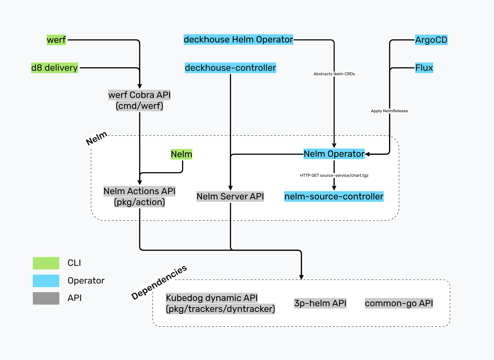

<!-- START doctoc generated TOC please keep comment here to allow auto update -->
<!-- DON'T EDIT THIS SECTION, INSTEAD RE-RUN doctoc TO UPDATE -->

- [Overview](#overview)
- [Global delivery architecture](#global-delivery-architecture)
- [Dependencies](#dependencies)
- [Actions architecture](#actions-architecture)

<!-- END doctoc generated TOC please keep comment here to allow auto update -->

## Overview

Nelm originally was just a werf deployment engine, but eventually got its own repo and CLI. Nelm is reusing parts of the Helm codebase, but most of its codebase is written from scratch.

## Global delivery architecture

This is how everything must fit together eventually:

Image source: https://boards.yandex.ru/whiteboard/?hash=3999734a7189448fe0bc10419b85cf03

Current differences:
1. Nelm Operator is not implemented, which means no ArgoCD/Flux integration and no Deckhouse Helm Operator module.
1. Nelm Server API is not implemented, so deckhouse-controller uses Nelm Actions API for now.

## Dependencies

Nelm depends on the following projects from the "werf" organization:

* https://github.com/werf/3p-helm is a fork of Helm with some modifications. We use some parts of this fork in Nelm.
* https://github.com/werf/kubedog is a library for tracking Kubernetes resource statuses, collecting logs and events during Nelm deployments.
* https://github.com/werf/common-go is a library with some common code shared between various werf projects.

Nelm is pretty straightforward: no frameworks, no CGO, no code generation, and the libraries we use are very common (e.g., Cobra for CLI). For the full list of dependencies, refer to the `go.mod` file.

## Actions architecture

Nelm Actions API provides various actions, such as `ReleaseInstall()` and `ReleaseUninstall()`, that mimic Nelm CLI commands. Nelm actions have a lot in common, but let's start with describing how the main action `ReleaseInstall()` and the corresponding CLI command `nelm release install` work under the hood:

1. Initialize Kubernetes clients, the registry client, logging, etc.
1. The Release namespace is created if it doesn't exist.
1. The Release is locked using an annotation on the ConfigMap `werf-synchronization` in the Release namespace.
1. `BuildHistory()` loads all revisions of the Release from Kubernetes Secrets (default).
1. `RenderChart()` downloads the chart and its dependencies, builds and merges values, then renders templates. Nelm mostly reuses code from the 3p-helm fork for this instead of reimplementing everything from scratch. `RenderChart()` builds and returns `[]ResourceSpec{}`. ResourceSpec represents an arbitrary resource with its basic metadata and a spec.
1. `BuildTransformedResourceSpecs()` transforms ResourceSpecs, e.g., expands all List resources.
1. `BuildReleasableResourceSpecs()` patches ResourceSpecs, e.g., applies ExtraAnnotations and ExtraLabels.
1. `NewRelease()` builds a new `Release{}` from ResourceSpecs. The Release struct is a serializable representation of the Helm Release.
1. If there is a previous revision of the Release, then we get ResourceSpecs from it too.
1. `BuildResources()` patches ResourceSpecs with Helm Release annotations and other runtime data that should not be saved in the Release but should be deployed to the cluster. Then it builds `[]InstallableResource{}` and `[]DeletableResource{}`. Installable/DeletableResource wraps ResourceSpec and represents a resource that we want to install or delete, with necessary attributes such as weight or dependencies computed and exposed. No cluster access is needed here.
1. `ValidateLocal()` validates the resources without contacting the Kubernetes cluster.
1. `BuildResourceInfos()` builds `[]InstallableResourceInfo{}` and `[]DeletableResourceInfo{}` from Installable/DeletableResources. Here we contact the cluster to get the current state of the resources, perform dry-run applies, compute diffs, and decide what to do with each resource (create, update, delete, noop, etc.). Installable/DeletableResourceInfo wraps Installable/DeletableResource and exposes additional attributes and extended information about what is going to be done to the resource.
1. `ValidateRemote()` validates the resources, contacting the Kubernetes cluster if needed.
1. `BuildReleaseInfos()` builds `[]ReleaseInfo{}` from Releases. ReleaseInfo wraps Release and exposes additional attributes and extended information about what is going to be done to the Release revision, e.g., created with some status, deleted, etc.
1. `BuildPlan()` from Resource/ReleaseInfos builds a `Plan{}` of actions to be performed on resources in the cluster. The plan is a Directed Acyclic Graph, with nodes representing actions on resources (create, update, delete, track readiness, etc.) and edges representing dependencies between those actions.
1. `IsReleaseUpToDate()` diffs the current and previous Release revisions to determine if there are any meaningful changes in the Release struct.
1. Based on the result of `IsReleaseUpToDate()` and whether the Plan has any meaningful actions to perform, we decide whether to proceed with the deployment or skip it.
1. Initialize resource tracking.
1. `ExecutePlan()` executes the Plan. It traverses the Plan graph in topological order, executing actions on resources while respecting dependencies between actions. This is where we actually change the cluster state and install a Helm Release.
1. If execution fails, we build a failure Plan and execute it in the same manner.
1. If execution fails and autorollback is enabled, we build a rollback Plan and execute it.
1. Finishing up: tracking stops, summary is printed, report is saved, etc.
1. The Release lock is released.

We try to follow this flow of `ReleaseInstall()` as much as possible in other actions. The main differences from other actions are where we get ResourceSpecs from and how early we terminate. Here are the main differences between `ReleaseInstall()` and other actions:
* `ReleaseRollback()` gets ResourceSpecs from the target Release revision instead of loading the chart and its dependencies, building values and rendering templates.
* `ReleaseUninstall()` gets ResourceSpecs from the latest Release revision, then builds a Plan that deletes resources instead of installing them.
* `ReleasePlanInstall()` does everything the same way as `ReleaseInstall()`, but instead of executing the Plan, it just provides a summary of what would be done.
* `ChartRender()` does everything the same way as `ReleaseInstall()`, but stops early, right when we have the manifests that we are going to apply to the cluster, then prints them. It also has a special flow for rendering without cluster access.
* `ChartLint()` works the same way as `ChartRender()`, but goes further, up to building a Plan. Has a special flow if no cluster access.
