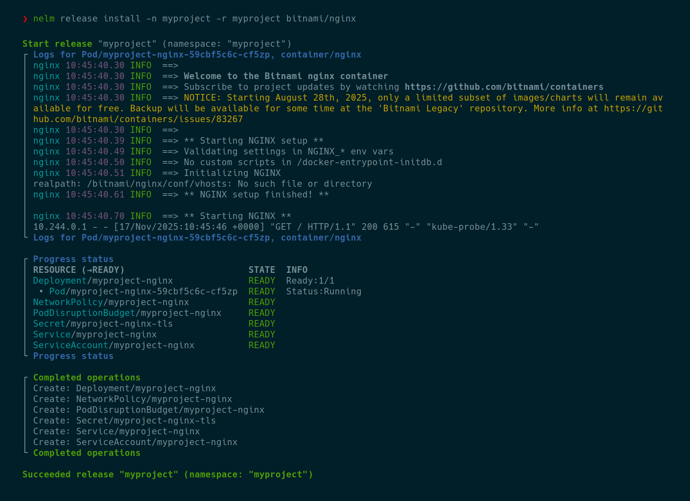
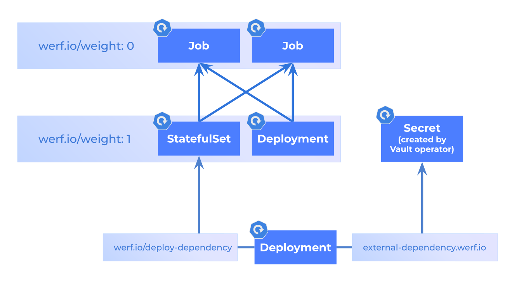
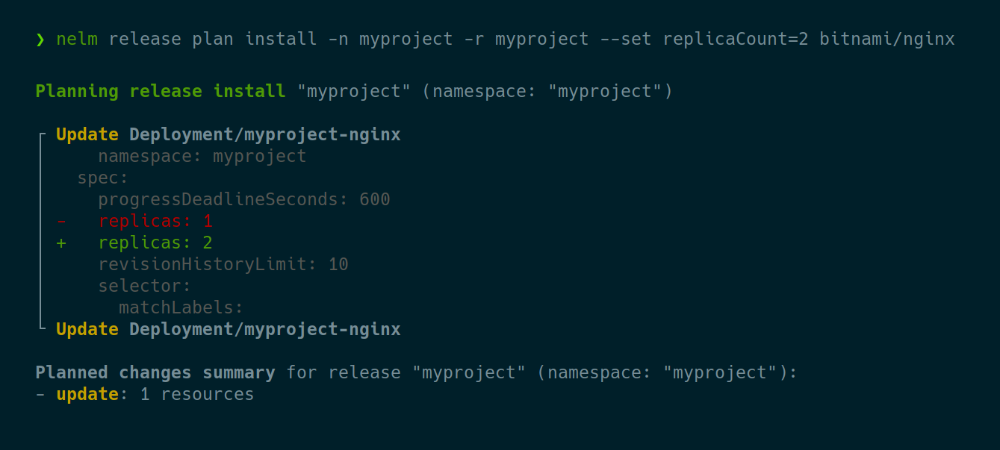

<!-- <p align="center">
  <a href="https://godoc.org/github.com/werf/nelm"></a>
  <a href="https://qlty.sh/gh/werf/projects/nelm"></a>
</p> -->

**Nelm** is a Helm 4 alternative. It is a Kubernetes deployment tool that manages Helm Charts and deploys them to Kubernetes. It is also the deployment engine of [werf](https://github.com/werf/werf). Nelm does everything that Helm does, but better, and even quite some on top of it. Nelm is based on an improved and partially rewritten Helm codebase, to introduce:

* `terraform plan`-like capabilities;
* improved CRD management;
* out-of-the-box secrets management;
* advanced resource ordering capabilities;
* advanced resource lifecycle capabilities;
* improved resource state/error tracking;
* continuous printing of logs, events, resource statuses, and errors during deployment;
* fixed hundreds of Helm bugs, e.g. ["no matches for kind Deployment in version apps/v1beta1"](https://github.com/helm/helm/issues/7219);
* performance and stability improvements and more.

The Nelm goal is to provide a modern alternative to Helm, with long-standing issues fixed and many new major features introduced. Nelm moves fast, but our focus remains on Helm Chart and Release compatibility, to ease the migration from Helm.

Nelm is production-ready: as the werf deployment engine, it was battle-tested across thousands of projects for years.



## Table of Contents

<!-- START doctoc generated TOC please keep comment here to allow auto update -->
<!-- DON'T EDIT THIS SECTION, INSTEAD RE-RUN doctoc TO UPDATE -->

- [Install](#install)
- [Quickstart](#quickstart)
- [CLI overview](#cli-overview)
- [Helm compatibility](#helm-compatibility)
- [Key features](#key-features)
  - [Advanced resource ordering](#advanced-resource-ordering)
  - [Advanced resource lifecycle capabilities](#advanced-resource-lifecycle-capabilities)
  - [Resource state tracking](#resource-state-tracking)
  - [Printing logs and events during deploy](#printing-logs-and-events-during-deploy)
  - [Release planning](#release-planning)
  - [Encrypted values and encrypted files](#encrypted-values-and-encrypted-files)
  - [Improved CRD management](#improved-crd-management)
- [Usage](#usage)
  - [Encrypted values files](#encrypted-values-files)
  - [Encrypted arbitrary files](#encrypted-arbitrary-files)
- [Reference](#reference)
  - [`werf.io/weight` annotation](#werfioweight-annotation)
  - [`werf.io/deploy-dependency-<id>` annotation](#werfiodeploy-dependency-id-annotation)
  - [`werf.io/delete-dependency-<id>` annotation](#werfiodelete-dependency-id-annotation)
  - [`<id>.external-dependency.werf.io/resource` annotation](#idexternal-dependencywerfioresource-annotation)
  - [`<id>.external-dependency.werf.io/name` annotation](#idexternal-dependencywerfioname-annotation)
  - [`werf.io/ownership` annotation](#werfioownership-annotation)
  - [`werf.io/deploy-on` annotation](#werfiodeploy-on-annotation)
  - [`werf.io/delete-policy` annotation](#werfiodelete-policy-annotation)
  - [`werf.io/delete-propagation` annotation](#werfiodelete-propagation-annotation)
  - [`werf.io/track-termination-mode` annotation](#werfiotrack-termination-mode-annotation)
  - [`werf.io/fail-mode` annotation](#werfiofail-mode-annotation)
  - [`werf.io/failures-allowed-per-replica` annotation](#werfiofailures-allowed-per-replica-annotation)
  - [`werf.io/no-activity-timeout` annotation](#werfiono-activity-timeout-annotation)
  - [`werf.io/sensitive` annotation](#werfiosensitive-annotation)
  - [`werf.io/sensitive-paths` annotation](#werfiosensitive-paths-annotation)
  - [`werf.io/log-regex` annotation](#werfiolog-regex-annotation)
  - [`werf.io/log-regex-for-<container_name>` annotation](#werfiolog-regex-for-container_name-annotation)
  - [`werf.io/log-regex-skip` annotation](#werfiolog-regex-skip-annotation)
  - [`werf.io/log-regex-skip-for-<container_name>` annotation](#werfiolog-regex-skip-for-container_name-annotation)
  - [`werf.io/skip-logs` annotation](#werfioskip-logs-annotation)
  - [`werf.io/skip-logs-for-containers` annotation](#werfioskip-logs-for-containers-annotation)
  - [`werf.io/show-logs-only-for-number-of-replicas` annotation](#werfioshow-logs-only-for-number-of-replicas-annotation)
  - [`werf.io/show-logs-only-for-containers` annotation](#werfioshow-logs-only-for-containers-annotation)
  - [`werf.io/show-service-messages` annotation](#werfioshow-service-messages-annotation)
  - [`werf_secret_file` function](#werf_secret_file-function)
  - [`dump_debug` function](#dump_debug-function)
  - [`printf_debug` function](#printf_debug-function)
  - [`include_debug` function](#include_debug-function)
  - [`tpl_debug` function](#tpl_debug-function)
- [Feature gates](#feature-gates)
  - [`NELM_FEAT_PREVIEW_V2` environment variable](#nelm_feat_preview_v2-environment-variable)
  - [`NELM_FEAT_REMOTE_CHARTS` environment variable](#nelm_feat_remote_charts-environment-variable)
  - [`NELM_FEAT_NATIVE_RELEASE_LIST` environment variable](#nelm_feat_native_release_list-environment-variable)
  - [`NELM_FEAT_NATIVE_RELEASE_UNINSTALL` environment variable](#nelm_feat_native_release_uninstall-environment-variable)
  - [`NELM_FEAT_PERIODIC_STACK_TRACES` environment variable](#nelm_feat_periodic_stack_traces-environment-variable)
  - [`NELM_FEAT_FIELD_SENSITIVE` environment variable](#nelm_feat_field_sensitive-environment-variable)
  - [`NELM_FEAT_CLEAN_NULL_FIELDS` environment variable](#nelm_feat_clean_null_fields-environment-variable)
  - [`NELM_FEAT_MORE_DETAILED_EXIT_CODE_FOR_PLAN` environment variable](#nelm_feat_more_detailed_exit_code_for_plan-environment-variable)
  - [`NELM_FEAT_PLAN_FREEZING` environment variable](#nelm_feat_plan_freezing-environment-variable)
- [More documentation](#more-documentation)
- [Limitations](#limitations)
- [Contributing](#contributing)
- [Special thanks](#special-thanks)
- [Future plans](#future-plans)

<!-- END doctoc generated TOC please keep comment here to allow auto update -->

## Install

Follow instructions on [GitHub Releases](https://github.com/werf/nelm/releases).

## Quickstart

1. Create a directory for a new chart:
    ```bash
    mkdir mychart
    cd mychart
    ```

1. Create `Chart.yaml` with the following content:
    ```yaml
    apiVersion: v2
    name: mychart
    version: 1.0.0
    dependencies:
    - name: cert-manager
      version: 1.13.3
      repository: https://charts.jetstack.io
    ```

1. Generate `Chart.lock`:
    ```bash
    nelm chart dependency download
    ```

1. Create `values.yaml` with the following content:
    ```yaml
    cert-manager:
      installCRDs: true
      startupapicheck:
        enabled: false
    ```

1. Deploy the first release:
    ```bash
    nelm release install -n myproject -r myproject
    ```

1. Plan the second release with an increased number of replicas, where only a single field in a single Deployment will be updated:
    ```bash
    nelm release plan install -n myproject -r myproject --set cert-manager.replicaCount=2
    ```

1. Deploy the second release, where only the Deployment will be updated:
    ```bash
    nelm release install -n myproject -r myproject --set cert-manager.replicaCount=2
    ```
   
## CLI overview

```yaml
Release commands:
  release install                    Deploy a chart to Kubernetes.
  release rollback                   Rollback to a previously deployed release.
  release plan install               Plan a release install to Kubernetes.
  release uninstall                  Uninstall a Helm Release from Kubernetes.
  release list                       List all releases in a namespace.
  release history                    Show release history.
  release get                        Get information about a deployed release.

Chart commands:
  chart lint                         Lint a chart.
  chart render                       Render a chart.
  chart download                     Download a chart from a repository.
  chart upload                       Upload a chart to a repository.
  chart pack                         Pack a chart into an archive to distribute via a repository.

Secret commands:
  chart secret key create            Create a new chart secret key.
  chart secret key rotate            Reencrypt secret files with a new secret key.
  chart secret values-file edit      Interactively edit encrypted values file.
  chart secret values-file encrypt   Encrypt values file and print result to stdout.
  chart secret values-file decrypt   Decrypt values file and print result to stdout.
  chart secret file edit             Interactively edit encrypted file.
  chart secret file encrypt          Encrypt file and print result to stdout.
  chart secret file decrypt          Decrypt file and print result to stdout.

Dependency commands:
  chart dependency download          Download chart dependencies from Chart.lock.
  chart dependency update            Update Chart.lock and download chart dependencies.

Repo commands:
  repo add                           Set up a new chart repository.
  repo remove                        Remove a chart repository.
  repo update                        Update info about available charts for all chart repositories.
  repo login                         Log in to an OCI registry with charts.
  repo logout                        Log out from an OCI registry with charts.

Other commands:
  completion bash                    Generate the autocompletion script for bash
  completion fish                    Generate the autocompletion script for fish
  completion powershell              Generate the autocompletion script for powershell
  completion zsh                     Generate the autocompletion script for zsh
  version                            Show version.
```
   
## Helm compatibility

Nelm is built upon the Helm codebase with some parts of Helm reimplemented. It is backward-compatible with Helm Charts and Helm Releases.

Helm Charts can be deployed by Nelm with no changes. All the obscure Helm Chart features, such as `lookup` functions, are supported.

To store release information, Nelm uses Helm Releases. You can deploy the same release with Helm and Nelm interchangeably, and it will work just fine. No migration needed from/to Helm.

Nelm has a different CLI layout, flags and environment variables, but we largely support all the same features as Helm.

Helm plugins support is not planned due to technical difficulties with the Helm plugins API. Instead, we intend to implement functionality of the most useful plugins natively, like we already did with `nelm release plan install` and `nelm chart secret`.

Generally, the migration from Helm to Nelm should be as simple as changing Helm commands to Nelm commands in your CI, for example:

| Helm command | Nelm command equivalent |
| -------- | ------- |
| `helm upgrade --install --atomic --wait -n myns myrls ./chart` | `nelm release install --auto-rollback -n myns -r myrls ./chart` |
| `helm uninstall -n myns myrls` | `nelm release uninstall -n myns -r myrls` |
| `helm template ./chart` | `nelm chart render ./chart` |
| `helm dependency build` | `nelm chart dependency download` |

## Key features

### Advanced resource ordering

The resource deployment subsystem of Helm is rewritten from scratch in Nelm. During the deployment, Nelm builds the Directed Acyclic Graph (DAG) of all operations we want to perform in the cluster to do the release, then the DAG is executed. The DAG allowed us to implement advanced resource ordering capabilities, such as:
* The `werf.io/weight` annotation: similar to `helm.sh/hook-weight`, but also works for non-hook resources. Resources with the same weight deployed in parallel.
* The `werf.io/deploy-dependency-<id>` annotation: do not deploy the annotated resource until the dependency is present or ready. This is the most powerful and effective way to enforce deployment order in Nelm.
* The `<id>.external-dependency.werf.io/resource` annotation: do not deploy the annotated resource until the dependency is ready. The dependency can be an external, non-release resource, e.g. a resource created by a third-party operator.
* Helm Hooks and their weights are supported, too.



### Advanced resource lifecycle capabilities

Helm doesn't offer any resource lifecycle capabilities, except `helm.sh/resource-policy: keep` and `helm.sh/hook-delete-policy` for Hooks. On top of these, Nelm offers the following:
* The `werf.io/delete-policy` annotation. Inspired by `helm.sh/hook-delete-policy`, but works for any resource. Set `before-creation` to always recreate the resource, `before-creation-if-immutable` to only recreate if the resource is immutable, `succeeded` or `failed` to delete the resource on success or failure. 
* The `werf.io/ownership` annotation. `anyone` allows to get Hook-like behavior for regular resources: don't delete the resource if it is removed from the Chart or when the whole release is removed, and never check or apply release annotations.
* The `werf.io/deploy-on` annotation. Inspired by `helm.sh/hook`. Render and deploy the resource only on install/upgrade/rollback/uninstall in a pre/main/post stage.

These annotations make Helm Hooks obsolete: regular resources can do all the same things now.

### Resource state tracking

Nelm has powerful resource tracking built from the ground up, much more advanced than what Helm has:
* Reliable detection of resources readiness, presence, absence or failures.
* Standard Kubernetes Resources have their own smart status trackers.
* Popular Custom Resources have hand-crafted rules to detect their statuses.
* For unknown Custom Resources, we heuristically determine their readiness by analyzing their status fields. Works for most Custom Resources. No false positives.
* The table with statuses, errors, and other info about currently tracked resources is printed every few seconds during the deployment.


### Printing logs and events during deploy

During the deployment, Nelm finds Pods of deploying resources and periodically prints their container logs. With annotation `werf.io/show-service-messages: "true"`, resource events are also printed. Can be configured with CLI flags and annotations.

### Release planning

`nelm release plan install` shows exactly what's going to happen in the cluster on the next release. It shows 100% accurate diffs between current and to-be resource versions, utilizing robust dry-run Server-Side Apply instead of client-side trickery.



### Encrypted values and encrypted files

`nelm chart secret` commands manage encrypted values files such as `secret-values.yaml` or encrypted arbitrary files like `secret/mysecret.txt`. These files are decrypted in-memory during templating and can be used in templates as `.Values.my.secret.value` and `{{ werf_secret_file "mysecret.txt" }}`, respectively.

### Improved CRD management

CRDs from the `crds/` directory of the chart deployed not only on the very first release install, but also on release upgrades. Also, CRDs not only can be created, but can be updated as well.

## Usage

Nelm-specific features are described below. For general documentation, see [Helm docs](https://helm.sh/docs/) and [werf docs](https://werf.io/docs/v2/usage/deploy/overview.html).

### Encrypted values files

Values files can be encrypted and stored in a Helm chart or a git repo. Such values files are decrypted in-memory during templating.

Create a secret key:
```bash
export NELM_SECRET_KEY="$(nelm chart secret key create)"
```

Create a new secret-values file:
```bash
nelm chart secret values-file edit secret-values.yaml
```
... with the following content:
```yaml
password: verysecurepassword123
```

Reference encrypted value in Helm templates:
```yaml
password: {{ .Values.password }}
```

Render the chart:
```bash
nelm chart render
```
```yaml
password: verysecurepassword123
```

NOTE: `$NELM_SECRET_KEY` must be set for any command that encrypts/decrypts secrets, including `nelm chart render`.

### Encrypted arbitrary files

Arbitrary files can be encrypted and stored in the `secret/` directory of a Helm chart. Such files are decrypted in-memory during templating.

Create a secret key:
```bash
export NELM_SECRET_KEY="$(nelm chart secret key create)"
```

Create a new secret file:
```bash
nelm chart secret file edit secret/config.yaml
```
... with the following content:
```yaml
user: john-doe
password: verysecurepassword123
```

Reference encrypted secret in Helm templates:
```yaml
config: {{ werf_secret_file "config.yaml" | nindent 4 }}
```

Render the chart:
```bash
nelm chart render
```
```yaml
config:
  user: john-doe
  password: verysecurepassword123
```

## Reference

Nelm-specific features are described below. For general documentation, see [Helm docs](https://helm.sh/docs/) and [werf docs](https://werf.io/docs/v2/usage/deploy/overview.html).

### `werf.io/weight` annotation 

This annotation works the same as `helm.sh/hook-weight`, but can be used for both hooks and non-hook resources. Resources with the same weight are grouped together, then the groups deployed one after the other, from low to high weight. Resources in the same group are deployed in parallel. This annotation has higher priority than `helm.sh/hook-weight`, but lower than `werf.io/deploy-dependency-<id>`.

Example:
```yaml
werf.io/weight: "10"
werf.io/weight: "-10"
```
Format:
```
werf.io/weight: "<any number>"
```
Default:
```
0
```

### `werf.io/deploy-dependency-<id>` annotation 

The resource will deploy only after all of its dependencies are satisfied. It waits until the specified resource is just `present` or is also `ready`. It serves as a more powerful alternative to hooks and `werf.io/weight`. You can only point to resources in the release. This annotation has higher priority than `werf.io/weight` and `helm.sh/hook-weight`. This annotation has no effect if the resource on which we depend upon is outside the stage (pre, main, post, ...) of the resource with the annotation.

Example:
```yaml
werf.io/deploy-dependency-db: state=ready,kind=StatefulSet,name=postgres
werf.io/deploy-dependency-app: state=present,kind=Deployment,group=apps,version=v1,name=app,namespace=app
```
Format:
```
werf.io/deploy-dependency-<anything>: state=ready|present[,name=<name>][,namespace=<namespace>][,kind=<kind>][,group=<group>][,version=<version>]
```

### `werf.io/delete-dependency-<id>` annotation

The resource will be deleted only after all of its dependencies are satisfied. It waits until the specified resource is `absent`. You can only point to resources in the release. This annotation has no effect if the resource on which we depend upon is outside the stage (pre, main, post, ...) of the resource with the annotation.

Example:
```yaml
werf.io/delete-dependency-db: state=absent,kind=StatefulSet,name=postgres
werf.io/delete-dependency-app: state=absent,kind=Deployment,group=apps,version=v1,name=app,namespace=app
```
Format:
```
werf.io/delete-dependency-<anything>: state=absent[,name=<name>][,namespace=<namespace>][,kind=<kind>][,group=<group>][,version=<version>]
```

### `<id>.external-dependency.werf.io/resource` annotation 

The resource will deploy only after all of its external dependencies are satisfied. It waits until the specified resource is `present` and `ready`. You can only point to resources outside the release.

Example:
```yaml
secret.external-dependency.werf.io/resource: secret/config
someapp.external-dependency.werf.io/resource: deployments.v1.apps/app
```
Format:
```
<anything>.external-dependency.werf.io/resource: <kind>[.<version>.<group>]/<name>
```

### `<id>.external-dependency.werf.io/name` annotation 

Set the namespace of the external dependency defined by `<id>.external-dependency.werf.io/resource`. `<id>` must match on both annotations. If not specified, the release namespace is used.

Example:
```yaml
someapp.external-dependency.werf.io/name: someapp-production
```
Format:
```
<anything>.external-dependency.werf.io/name: <name>
```

### `werf.io/ownership` annotation 

Inspired by Helm hooks. Sets the ownership of the resource. `release` means that the resource is deleted if removed from the chart or when the release is uninstalled, and release annotations of the resource are applied/validated during deploy. `anyone` means the opposite: resource is never deleted on uninstall or when removed from the chart, and release annotations are not applied/validated during deploy.

Example:
```yaml
werf.io/ownership: anyone
```
Format:
```
werf.io/ownership: anyone|release
```
Default:
```
"release" for general resources, "anyone" for hooks and CRDs from "crds/" directory
```

### `werf.io/deploy-on` annotation 

Inspired by `helm.sh/hook`. Render the resource for deployment only on the specified deploy types and stages. Has precedence over `helm.sh/hook`.

Beware that with `werf.io/ownership: release` if the resource is rendered for install, but, for example, not for upgrade, then it is going to be deployed on install, but then deleted on upgrade, so you might want to consider `werf.io/ownership: anyone`.

Example:
```yaml
werf.io/deploy-on: pre-install,upgrade
```
Format:
```
werf.io/deploy-on: [pre-install][,install][,post-install][,pre-upgrade][,upgrade][,post-upgrade][,pre-rollback][,rollback][,post-rollback][,pre-uninstall][,uninstall][,post-uninstall]
```
Default:
```
"install,upgrade,rollback" for general resources, populated from "helm.sh/hook" for hooks
```

### `werf.io/delete-policy` annotation 

Inspired by `helm.sh/hook-delete-policy`. Controls resource deletions during resource deployment. `before-creation` means always recreate the resource, `before-creation-if-immutable` means recreate the resource only when we got "field is immutable" error during its update, `succeeded` means delete the resource at the end of the current deployment stage if the resource was successfully deployed, `failed` means delete the resource if it's readiness check failed. Has precedence over `helm.sh/hook-delete-policy`.

Example:
```yaml
werf.io/delete-policy: before-creation,succeeded
```
Format:
```
werf.io/delete-policy: [before-creation][,before-creation-if-immutable][,succeeded][,failed]
```
Default:
```
nothing for general resources (unless Job, then "before-creation-if-immutable"), mapped from "helm.sh/hook-delete-policy" for hooks
```

### `werf.io/delete-propagation` annotation

Set the deletion propagation policy for the resource. `Foreground` means delete the resource after deleting all of its dependents, `Background` means delete the resource immediately, and delete all of its dependents in the background, and `Orphan` means delete the resource, but leave all of its dependents untouched.

Example:
```yaml
werf.io/delete-propagation: Background
```
Format:
```
werf.io/delete-propagation: Foreground|Background|Orphan
```
Default:
```
Foreground
```

### `werf.io/track-termination-mode` annotation 

Configure when to stop resource readiness tracking:
* `WaitUntilResourceReady`: wait until the resource is `ready`.
* `NonBlocking`: don't wait until the resource is `ready`.

Example:
```yaml
werf.io/track-termination-mode: NonBlocking
```
Format:
```
werf.io/track-termination-mode: WaitUntilResourceReady|NonBlocking
```
Default:
```
WaitUntilResourceReady
```

### `werf.io/fail-mode` annotation 

Configure what should happen when errors during tracking for the resource exceeded `werf.io/failures-allowed-per-replica`:
* `FailWholeDeployProcessImmediately`: fail the release.
* `IgnoreAndContinueDeployProcess`: do nothing.

Example:
```yaml
werf.io/fail-mode: IgnoreAndContinueDeployProcess
```
Format:
```
werf.io/fail-mode: FailWholeDeployProcessImmediately|IgnoreAndContinueDeployProcess
```
Default:
```
FailWholeDeployProcessImmediately
```

### `werf.io/failures-allowed-per-replica` annotation 

Set the number of allowed errors during resource tracking. When exceeded, act according to `werf.io/fail-mode`.

Example:
```yaml
werf.io/failures-allowed-per-replica: "0"
```
Format:
```
werf.io/failures-allowed-per-replica: "<any positive number or zero>"
```
Default:
```
1
```

### `werf.io/no-activity-timeout` annotation 

Take it as a resource tracking error if no new events or resource updates are received during resource tracking for the specified time.

Example:
```yaml
werf.io/no-activity-timeout: 8m30s
```
Format ([more info](https://pkg.go.dev/time#ParseDuration)):
```
werf.io/no-activity-timeout: <golang duration>
```
Default:
```
4m
```

### `werf.io/sensitive` annotation 

DEPRECATED. Use `werf.io/sensitive-paths` instead.

Don't show diffs for the resource.

`NELM_FEAT_FIELD_SENSITIVE` feature gate alters behavior of this annotation.

Example:
```yaml
werf.io/sensitive: "true"
```
Format:
```
werf.io/sensitive: "true|false"
```
Default:
```
"false", but for "v1/Secret" — "true"
```

### `werf.io/sensitive-paths` annotation 

Don't show diffs for resource fields that match specified JSONPath expressions. Overrides the behavior of `werf.io/sensitive`.

Example:
```yaml
werf.io/sensitive-paths: "$.spec.template.spec.containers[*].env[*].value,$.data.*"
```
Format:
```
werf.io/sensitive-paths: <JSONPath>,<JSONPath>,...
```

### `werf.io/log-regex` annotation 

Only show log lines that match the specified regex.

Example:
```yaml
werf.io/log-regex: ".*ERR|err|WARN|warn.*"
```
Format ([more info](https://github.com/google/re2/wiki/Syntax)):
```
werf.io/log-regex: <re2 regex>
```

### `werf.io/log-regex-for-<container_name>` annotation 

For the specified container, only show log lines that match the specified regex.

Example:
```yaml
werf.io/log-regex-for-backend: ".*ERR|err|WARN|warn.*"
```
Format ([more info](https://github.com/google/re2/wiki/Syntax)):
```
werf.io/log-regex-for-backend: <re2 regex>
```

### `werf.io/log-regex-skip` annotation 

Don't show log lines that match the specified regex.

Example:
```yaml
werf.io/log-regex-skip: ".*TRACE|trace|DEBUG|debug.*"
```
Format ([more info](https://github.com/google/re2/wiki/Syntax)):
```
werf.io/log-regex-skip: <re2 regex>
```

### `werf.io/log-regex-skip-for-<container_name>` annotation 

For the specified container, exclude log lines that match the specified regex.

Example:
```yaml
werf.io/log-regex-skip-for-backend: ".*ERR|err|WARN|warn.*"
```
Format ([more info](https://github.com/google/re2/wiki/Syntax)):
```
werf.io/log-regex-skip-for-backend: <re2 regex>
```

### `werf.io/skip-logs` annotation 

Don't print container logs during resource tracking.

Example:
```yaml
werf.io/skip-logs: "true"
```
Format:
```
werf.io/skip-logs: "true|false"
```
Default:
```
false
```

### `werf.io/skip-logs-for-containers` annotation 

Don't print logs for specified containers during resource tracking.

Example:
```yaml
werf.io/skip-logs-for-containers: "backend,frontend"
```
Format:
```
werf.io/skip-logs-for-containers: <container_name>[,<container_name>...]
```

### `werf.io/show-logs-only-for-number-of-replicas` annotation 

Print logs only for the specified number of replicas during resource tracking. We print logs only for a single replica by default to avoid excessive log output and to optimize resource usage.

Example:
```yaml
werf.io/show-logs-only-for-number-of-replicas: "999"
```
Format:
```
werf.io/show-logs-only-for-number-of-replicas: "<any positive number or zero>"
```
Default:
```
1
```

### `werf.io/show-logs-only-for-containers` annotation 

Print logs only for specified containers during resource tracking.

Example:
```yaml
werf.io/show-logs-only-for-containers: "backend,frontend"
```
Format:
```
werf.io/show-logs-only-for-containers: <container_name>[,<container_name>...]
```

### `werf.io/show-service-messages` annotation 

Show resource events during resource tracking.

Example:
```yaml
werf.io/show-service-messages: "true"
```
Format:
```
werf.io/show-service-messages: "true|false"
```
Default:
```
false
```

### `werf_secret_file` function 

Read the specified secret file from the `secret/` directory of the Helm chart.

Example:
```
config: {{ werf_secret_file "config.yaml" | nindent 4 }}
```
Format:
```
{{ werf_secret_file "<filename, relative to secret/ dir>" }}
```

### `dump_debug` function 

If the log level is `debug`, then pretty-dumps the passed value to the logs. Handles just fine any kind of complex types, including .Values, or event root context. Never prints to the templating output.

Example:
```
{{ dump_debug $ }}
```
Format:
```
{{ dump_debug "<value of any type>" }}
```

### `printf_debug` function 

If the log level is `debug`, then prints the result to the logs. Never prints to the templating output.

Example:
```
{{ printf_debug "myval: %s" .Values.myval }}
```
Format:
```
{{ printf_debug "<format string>" <args...> }}
```

### `include_debug` function 

Works exactly like the `include` function, but if the log level is `debug`, then also prints various include-related debug information to the logs. Useful for debugging complex includes/defines.

Example:
```
{{ include_debug "mytemplate" . }}
```
Format:
```
{{ include_debug "<template name>" <context> }}
```

### `tpl_debug` function 

Works exactly like the `tpl` function, but if the log level is `debug`, then also prints various tpl-related debug information to the logs. Useful for debugging complex tpl templates.

Example:
```
{{ tpl_debug "{{ .Values.myval }}" . }}
```
Format:
```
{{ tpl_debug "<template string>" <context> }}
```

## Feature gates

### `NELM_FEAT_PREVIEW_V2` environment variable

Activates all feature gates that will be enabled by default in v2.

Example:
```shell
export NELM_FEAT_PREVIEW_V2=true
nelm release list
```

### `NELM_FEAT_REMOTE_CHARTS` environment variable

Allows specifying not only local, but also remote charts as a command-line argument to commands such as `nelm release install`. Adds the `--chart-version` option as well.

Will be the default in the next major release.

Example:
```shell
export NELM_FEAT_REMOTE_CHARTS=true
nelm release install -n myproject -r myproject --chart-version 19.1.1 bitnami/nginx
```

### `NELM_FEAT_NATIVE_RELEASE_LIST` environment variable

Use native Nelm implementation of the `release list` command instead of `helm list` exposed as `release list`. Implementations differ a bit, but serve the same purpose.

Will be the default in the next major release.

Example:
```shell
export NELM_FEAT_NATIVE_RELEASE_LIST=true
nelm release list
```

### `NELM_FEAT_NATIVE_RELEASE_UNINSTALL` environment variable

Use a new native Nelm implementation of the `release uninstall` command. Not fully backwards compatible with previous implementation.

Will be the default in the next major release.

Example:
```shell
export NELM_FEAT_NATIVE_RELEASE_UNINSTALL=true
nelm release uninstall -n myproject -r myproject
```

### `NELM_FEAT_PERIODIC_STACK_TRACES` environment variable

Every few seconds print stack traces of all goroutines. Useful for debugging purposes.

Example:
```shell
export NELM_FEAT_PERIODIC_STACK_TRACES=true
nelm release install -n myproject -r myproject
```

### `NELM_FEAT_FIELD_SENSITIVE` environment variable

When showing diffs for Secrets or `werf.io/sensitive: "true"` annotated resources, instead of hiding the entire resource diff hide only the actual secret fields: `$.data`, `$.stringData`.

Will be the default in the next major release.

Example:
```shell
export NELM_FEAT_FIELD_SENSITIVE=true
nelm release plan install -n myproject -r myproject
```

### `NELM_FEAT_CLEAN_NULL_FIELDS` environment variable

Improve Helm chart compatibility. When rendering charts, remove keys with `null` values from the rendered resource manifests, before applying them. Otherwise, SSA often fail on `null` values, which didn't happen with 3WM.

Will be the default in the next major release.

Example:
```shell
export NELM_FEAT_CLEAN_NULL_FIELDS=true
nelm release install -n myproject -r myproject
```

### `NELM_FEAT_MORE_DETAILED_EXIT_CODE_FOR_PLAN` environment variable

When the `--exit-code` flag is specified for `nelm release plan install`, return exit code 3, if no resource changes planned, but release still must be installed. Previously, exit code 2 was returned in this case.

Will be the default in the next major release.

Example:
```shell
export NELM_FEAT_MORE_DETAILED_EXIT_CODE_FOR_PLAN=true
nelm release plan install -n myproject -r myproject --exit-code
```

### `NELM_FEAT_PLAN_FREEZING` environment variable

When the `--save-plan` flag is specified for `nelm release plan install`, generated plan will be saved by specified path for future use by `nelm release install --use-plan`.

Will be the default in the next major release.

Example:
```shell
export NELM_FEAT_PLAN_FREEZING=true
nelm release plan install -n myproject -r myproject --save-plan <path to plan file>
nelm release install --use-plan <path to plan file>
```

If you wish to review changes in generated plan file, use the following command:
```shell
export NELM_FEAT_PLAN_FREEZING=true
nelm release plan show <path to plan file>
```

## More documentation

For documentation on regular Helm features, see [Helm docs](https://helm.sh/docs/). A lot of useful documentation can be found in [werf docs](https://werf.io/docs/v2/usage/deploy/overview.html).

## Limitations

* Nelm requires Server-Side Apply enabled in Kubernetes. It is enabled by default since Kubernetes 1.16. In Kubernetes 1.14-1.15 it can be enabled, but disabled by default. Kubernetes 1.13 and older doesn't have Server-Side Apply, thus Nelm won't work with it.
* *Helm sometimes uses Values from the previous Helm release to deploy a new release*. This is to make Helm easier to use without a proper CI/CD process. This is dangerous, goes against IaC and this is not what users expect. Nelm will never do this: what you explicitly pass via `--values` and `--set` options will be merged with chart values files, then applied to the cluster, as expected.

## Contributing

See [CONTRIBUTING.md](CONTRIBUTING.md).

## Special thanks

- Helm developers for the Helm codebase that Nelm is built upon.
- [@DmitryBochkarev](https://github.com/DmitryBochkarev) for the [TypeScript support](https://github.com/werf/nelm/pull/502) in charts.
- [@kuzaxak](https://github.com/kuzaxak) for the [werf.io/sensitive-paths](https://github.com/werf/nelm/pull/364) annotation.

## Future plans

- [x] Nelm CLI.
- [x] Nelm v1.
- [x] Refactor, stabilize.
- [x] Advanced resource lifecycle management.
- [x] Advanced Kubeconform-based local validation.
- [ ] Nelm v2.
- [ ] Migration to Helm v4.
- [ ] The Nelm operator, which can integrate with ArgoCD/Flux ([#494](https://github.com/werf/nelm/issues/494)).
- [ ] An alternative to Helm templating ([#54](https://github.com/werf/nelm/issues/54)).
- [ ] Resource patching support ([#115](https://github.com/werf/nelm/issues/115)).
- [ ] DRY values.yaml files ([#495](https://github.com/werf/nelm/issues/495)).
- [ ] Downloading charts directly from Git.
- [ ] Migrate the built-in secrets management to Mozilla SOPS ([#62](https://github.com/werf/nelm/issues/62)).
- [ ] Nelmfile.
