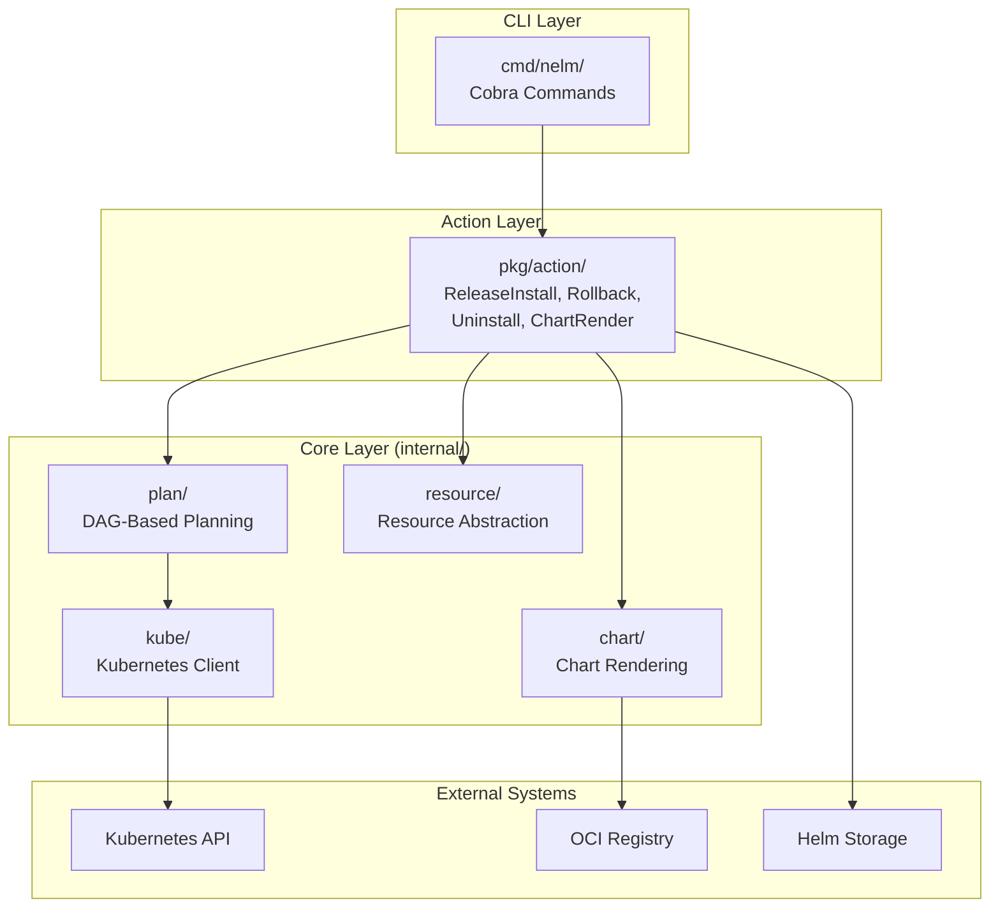
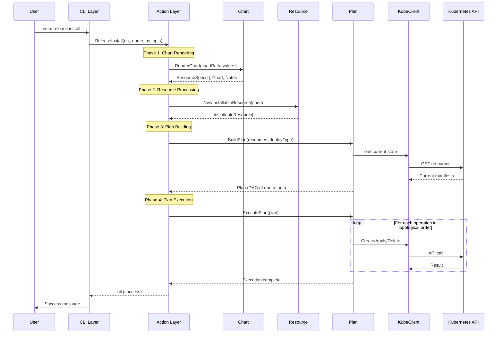

# Nelm Architecture

<!-- toc -->
- [Overview](#overview)
- [Layered Architecture Diagram](#layered-architecture-diagram)
- [Package Structure](#package-structure)
  - [CLI Layer: cmd/nelm/](#cli-layer-cmdnelm)
  - [Action Layer: pkg/action/](#action-layer-pkgaction)
  - [Shared Types: pkg/common/](#shared-types-pkgcommon)
  - [Core Layer: internal/](#core-layer-internal)
- [Data Flow Sequence Diagram](#data-flow-sequence-diagram)
- [Key Architectural Decisions](#key-architectural-decisions)
  - [1. DAG-Based Execution](#1-dag-based-execution)
  - [2. Two-Phase Deployment](#2-two-phase-deployment)
  - [3. Helm Compatibility](#3-helm-compatibility)
  - [4. Annotation-Driven Behavior](#4-annotation-driven-behavior)
  - [5. TypeScript Chart Support](#5-typescript-chart-support)
<!-- tocstop -->

## Overview

Nelm follows a layered architecture pattern with clear separation of concerns between CLI, business logic, and infrastructure layers.

## Layered Architecture Diagram

## Package Structure

### CLI Layer: cmd/nelm/

CLI entry point using Cobra for command parsing. Each command file maps to an action.

| File                          | Purpose                          |
| ----------------------------- | -------------------------------- |
| `common_flags.go`             | Shared flag definitions          |
| `groups.go` / `root.go`       | Command groups and root command  |
| `release_plan_install.go`     | Plan install command (diff/dry-run) |
| `release_install.go`          | Main install command             |
| `usage.go`                    | Custom usage formatting          |
| `chart_lint.go`               | Chart linting command            |
| `chart_render.go`             | Template rendering command       |
| `chart_*`                     | Chart packaging, download/upload, init, dependency management, and secret subcommands |
| `repo_*`                      | Chart repository/OCI registry configuration and auth |
| `release_rollback.go`         | Rollback command                 |
| `release_uninstall.go`        | Uninstall command                |
| `release_get.go`              | Release info command             |
| `release_uninstall_legacy.go` | Legacy Helm 3 uninstall          |

### Action Layer: pkg/action/

High-level business logic that orchestrates core components.

| File                      | Purpose                               |
| ------------------------- | ------------------------------------- |
| `release_install.go`      | Full install workflow with tracking   |
| `release_plan_install.go` | Dry-run planning (no cluster changes) |
| `release_rollback.go`     | Rollback to previous revision         |
| `chart_render.go`         | Chart rendering without deployment    |
| `release_uninstall.go`    | Release deletion workflow             |
| `chart_lint.go`           | Chart validation and linting          |
| `release_list.go`         | List releases                         |
| `release_get.go`          | Get release details                   |
| `secret_*.go`             | Encrypted values/files and key rotation workflows |
| `common.go`               | Shared utilities                      |

### Shared Types: pkg/common/

| File        | Purpose                                     |
| ----------- | ------------------------------------------- |
| `common.go` | Constants, enums (DeployType, DeletePolicy) |
| `options.go`| Shared option structs for actions           |

### Core Layer: internal/

#### internal/plan/ - DAG-Based Planning

| File                 | Purpose                             |
| -------------------- | ----------------------------------- |
| `plan_build.go`      | Build operation DAG from resources  |
| `plan_execute.go`    | Parallel operation execution        |
| `plan.go`            | Plan struct (graph wrapper)         |
| `planned_changes.go` | Change summary for dry-run          |
| `resource_info.go`   | Resource state and diff calculation |
| `release_info.go`    | Release-related plan nodes and decisions |
| `operation_config.go`| Operation configuration             |
| `operation.go`       | Operation types and IDs             |
| `validate.go`        | Plan validation helpers             |

#### internal/resource/ - Resource Abstraction

| File           | Purpose                              |
| -------------- | ------------------------------------ |
| `metadata.go`  | Annotation/label parsing (werf.io/*) |
| `dependency.go`| Internal/external dependency management |
| `resource.go`  | InstallableResource struct           |
| `sensitive.go` | Sensitive data masking               |
| `validate.go`  | Resource validation                  |
| `spec/`        | ResourceSpec, ResourceMeta types     |

#### internal/kube/ - Kubernetes Client

| File                  | Purpose                            |
| --------------------- | ---------------------------------- |
| `client_kube.go`      | High-level K8s client with caching |
| `config.go`           | Kubeconfig handling                |
| `factory.go`          | Client factory pattern             |
| `client_discovery.go` | API discovery client               |
| `client_dynamic.go`   | Dynamic client wrapper             |
| `client_static.go`    | Typed client wrapper               |
| `client_mapper.go`    | RESTMapper wrapper                 |
| `legacy_client_getter.go` | Helm-compatible client getter  |

#### internal/track/ - Progress Tracking

| File                 | Purpose                        |
| -------------------- | ------------------------------ |
| `progress_tables.go` | Real-time progress table rendering |

#### internal/release/ - Release Storage

| File                 | Purpose                      |
| -------------------- | ---------------------------- |
| `release.go`         | Helm release construction    |
| `history.go`         | Release history management   |
| `release_storage.go` | Storage driver abstraction   |

#### internal/chart/ - Chart Processing

| File               | Purpose                         |
| ------------------ | ------------------------------- |
| `chart_render.go`  | Template rendering with Helm engine |
| `chart_download.go`| Chart fetching from registries  |

#### internal/ts/ - TypeScript Charts

| File         | Purpose                       |
| ------------ | ----------------------------- |
| `render.go`  | TypeScript chart rendering    |
| `bundle.go`  | Chart bundling                |
| `esbuild.go` | esbuild integration           |
| `init.go`    | TypeScript chart initialization |
| `runtime.go` | JavaScript runtime (Goja) execution |

#### internal/lock/ - Release Locking

Locking helpers built on `werf/lockgate` (currently implemented via ConfigMaps) to prevent concurrent operations on the same release.

| File              | Purpose |
| ----------------- | ------- |
| `lock_manager.go` | Acquire/release locks and handle lease-loss failures |

#### internal/legacy/ - Legacy Compatibility

Compatibility helpers used by legacy commands/behavior and backwards-compat integrations.

#### internal/util/ - Utilities

Shared helpers (e.g., error aggregation, parsers) used across actions and core packages.

## Data Flow Sequence Diagram

## Key Architectural Decisions

### 1. DAG-Based Execution

Operations form a Directed Acyclic Graph (DAG) using the `dominikbraun/graph` library. This enables:
- Parallel execution of independent operations
- Automatic dependency resolution via annotations
- Transitive reduction for optimal execution order

### 2. Two-Phase Deployment

1. **Plan Phase**: Build complete operation graph without cluster changes
2. **Execute Phase**: Apply operations with real-time tracking

This separation enables dry-run (`release plan install`) and accurate change previews.

### 3. Helm Compatibility

- Uses `werf/3p-helm` (forked Helm SDK) for chart rendering
- Stores releases in Helm-compatible format (Secrets/ConfigMaps; optional SQL/Memory drivers)
- Supports standard Helm chart structure

### 4. Annotation-Driven Behavior

Resource behavior controlled via annotations (`werf.io/*`):
- `werf.io/weight` - Deployment ordering
- `werf.io/deploy-dependency-*` - Explicit dependencies
- `werf.io/track-*` - Tracking configuration
- `werf.io/delete-policy` - Deletion behavior

### 5. TypeScript Chart Support

Native TypeScript/JavaScript support for chart templating via embedded JavaScript runtime (Goja) using esbuild for bundling. This capability is guarded by the `NELM_FEAT_TYPESCRIPT` feature gate.
